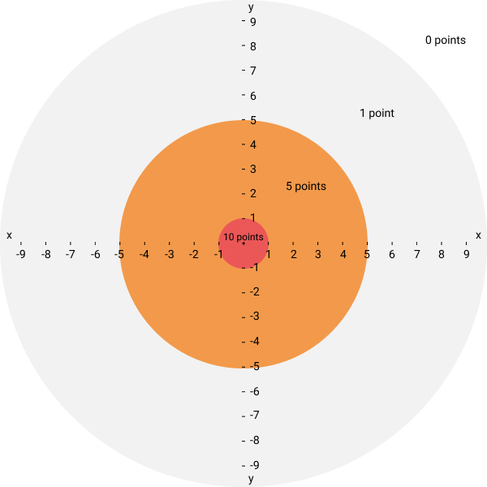
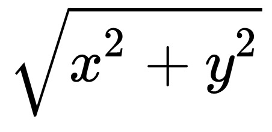

# Exercice 4

> Pour ceux qui ne sont pas trop maths et géométrie, il y a un indice en fin d'énoncé 👌.

Le jeu des fléchettes se joue sur une cible. Vous lancez une fléchette sur cette cible, elle atterrit quelque part et en fonction de sa position, vous gagnez un certain nombre de points :

* En dehors de la cible : 0 points.
* À l'intérieur du cercle extérieur (gris) : 1 point.
* À l'intérieur du cercle du milieu (orange) : 5 points.
* À l'intérieur du cercle intérieur (rouge) : 10 points.
* Si on tombe pile à la périphérie d'un cercle, on considère qu'on est à l'intérieur de ce cercle.

La structure de la cible est la suivante :

* Le cercle extérieur (gris) a un `rayon` de `10` unités.
* Le cercle du milieu (orange) a un `rayon` de `5` unités.
* Le cercle intérieur (rouge) a un `rayon` d'`1` unité.

Les 3 cercles sont tous centrés sur la position d'origine représentée par une petite croix noire au centre du cercle rouge.

On note les coordonnées d'une position `(x,y)` où `x` représente la valeur sur l'axe des abscisses (axe horizontal) et `y` sur l'axe des ordonnées (axe vertical).

Le centre a comme coordonnées `x = 0, y = 0` c'est-à-dire `(0,0)`.

Écrivez une fonction qui renvoie le nombre de points gagnés en fonction des coordonnées de la position de la fléchette sur la cible.

Les coordonnées peuvent être des nombres entiers ou à virgules, positifs ou négatifs.

## Exemples
- Pour `(4,4)`, soit `x = 4` et `y = 4` il faut renvoyer la valeur `1`, car on gagne `1` point. La flèche atterrit en haut à droite, juste au dessus du cercle orange.
- Pour `(2,2)` il faut renvoyer `5` points.
- Pour `(3,1)` il faut renvoyer `5` points.
- Pour `(5,0)`, on est pile à la limite du cercle orange, donc on considère qu'on est dans le cercle orange, il faut retourner `5` points.
- Pour `(0.8,-0.8)` il faut renvoyer `5` points.
- Pour `(0,-1)`, on est pile à la limite du cercle rouge, il faut renvoyer `10` points.
- Pour `(0.4,0.8)`, il faut renvoyer `10` points.

## Indice

En utilisant le théorème de Pythagore, on peut calculer la distance entre la position de la flèche et le centre de la cible.

Descendez plus bas, je vous donne la formule à utiliser pour calculer directement cette distance.

↓↓↓↓↓↓↓↓↓↓↓↓↓↓↓↓↓↓↓↓↓↓↓↓↓↓↓↓

.

.

.

.

.

↓↓↓↓↓↓↓↓↓↓↓↓↓↓↓↓↓↓↓↓↓↓↓↓↓↓↓↓

.

.

.

.

.

↓↓↓↓↓↓↓↓↓↓↓↓↓↓↓↓↓↓↓↓↓↓↓↓↓↓↓↓

.

.

.

.

.

↓↓↓↓↓↓↓↓↓↓↓↓↓↓↓↓↓↓↓↓↓↓↓↓↓↓↓↓

.

.

.

.

.

↓↓↓↓↓↓↓↓↓↓↓↓↓↓↓↓↓↓↓↓↓↓↓↓↓↓↓↓

.

.

.

.

.

↓↓↓↓↓↓↓↓↓↓↓↓↓↓↓↓↓↓↓↓↓↓↓↓↓↓↓↓

## Formule de calcul de la distance
Pour obtenir la distance entre le centre de la cible et la position `(x,y)` de la fléchette, il faut utiliser la formule suivante :

